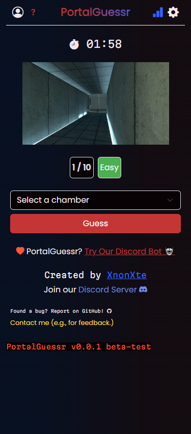

# PortalGuessr Website

    
    

        
        
        
        
    

PortalGuessr on the web created with mobile appearance in mind.

## Installation

- Run `npm install` for both the backend and frontend directories to install the required dependencies to run the app.
- In the backend folder, create a `.env` file containing `MONGODB_DATABASE_URL` for your MongoDB URL and `SERVER_PORT` for the port on which the server will run.
- Run `npm run dev` for starting the development server on either the frontend or backend (you can also do `npm run server` on the backend if you don't want to start Nodemon).

## Trello Workspace

The official trello workspace for this project: <https://trello.com/b/NgVubCDX/portalguessr-fullstack>
